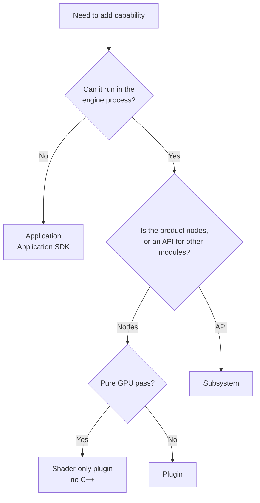

# Extension model

There are three ways to add capability to Nodos. Choosing between them is mostly a question of
where the code has to live and what it needs to reach.

| | Plugin | Subsystem | Application |
|---|---|---|---|
| Runs in | Engine process | Engine process | Its own process |
| Adds | Nodes and types | An API for other modules | One node representing itself |
| SDK | Plugin SDK | Plugin SDK | Application SDK |
| Boundary | C ABI, in-process | C ABI, in-process | gRPC + FlatBuffers |
| Cost | Lowest latency | Lowest latency | IPC per interaction |
| Failure | Can take the engine down | Can take the engine down | Isolated |

## Plugins

A plugin contributes node classes and pin data types. The engine loads it dynamically, and its
nodes become available in the graph.

This is the default answer. If your code can live in the engine process, make it a plugin — it is
the least machinery and the fastest path from a pin to your code.

A plugin's shape is a manifest, node definitions, and C++ implementations:

```plaintext
mycorp.myplugin/
├── mycorp.myplugin.nosplugin
├── Nodes/*.nosnode
└── Source/*.cpp
```

Nodes register through `nosNodeFunctions` and participate directly in scheduling and execution. See
[Your first plugin](../tutorials/your-first-plugin.md).

### Shader-only plugins

A plugin whose nodes are all GPU passes needs no binary at all. Declare `nos.sys.vulkan` as a
dependency, point each node definition at a shader, and ship the shader. See
[Write a shader-only node](../how-to/write-a-shader-node.md).

## Subsystems

A subsystem exposes a C API for other modules to call. `nos.sys.vulkan` is the clearest example: it
does not contribute many nodes, it gives every other module the ability to record GPU commands.

On Nodos {{ nodos_version }} a subsystem is structurally identical to a plugin — same `.nosplugin`
manifest, same scaffold. The difference is intent: a subsystem's product is its header, not its
nodes.

Write one when several modules need to share capability or state that would otherwise be duplicated
or fought over — a device pool, a compiler, a settings store.

The consequence of that choice is versioning discipline. Your public header is an API contract with
modules you do not control, so a change to a struct layout or a function signature is a major
version bump. A plugin that only contributes nodes has a much softer contract.

## Applications

An application links the Application SDK and connects to a running engine over gRPC. The engine
creates one node representing it. The application can modify that node — add pins, read and write
values — but it cannot create additional nodes.

Choose this when the code cannot live in the engine process:

- It already exists and has its own release cycle — a renderer, a control system.
- It uses a graphics API the engine does not host. Nodos has no DirectX 12 backend, but a DX12
  application can share textures with it.
- It must be isolated, so that its crash does not take the engine with it.
- It runs on a different machine.

The trade is IPC on every interaction and an asynchronous, callback-driven programming model. See
[Connect an external application](../how-to/connect-an-external-app.md).

### Process nodes

The engine can also launch and manage application processes itself, through process nodes — which
is why `nosLauncher` has `--disable-process-auto-launch` for cases where an external orchestrator
should own process lifetimes instead.

## Load and unload order

The order your plugin's callbacks fire in is a contract you can rely on, and most load failures are
explained by it.

**Loading**

1. Dependencies are resolved and loaded first. A plugin whose declared dependencies cannot be
   satisfied does not load at all — so if your plugin never appears, check its dependency versions
   before you check your own code.
2. Your binary is loaded and its exported entry points resolved.
3. Your static contributions are registered — types, defaults, named values. These exist before any
   node does.
4. Your node classes and object types are registered.
5. `Initialize` is called.

By the time `Initialize` runs, every dependency's API pointer is valid and your types are known to
the engine. It is the right place for one-time setup: registering shaders and passes, opening a
device, allocating a pool.

**Unloading**

1. `OnPreUnloadPlugin` is called.
2. Your contributions are removed from the engine.

Unload happens in dependency order, so a module you depend on is not torn down before you are.
Release anything the engine must not outlive in `OnPreUnloadPlugin` — after it returns, your
registrations are gone.

## Two callback layers

Extensions hook the engine at two levels, and it is easy to reach for the wrong one.

**Node-level** (`nosNodeFunctions`) — per node instance: `OnNodeCreated`, `OnNodeUpdated`,
`OnPinUpdated`, `ExecuteNode`, `CopyFrom`, `OnPathStart` / `OnPathStop`, `OnBeginFrame` /
`OnEndFrame`.

**Plugin-level** (`nosPluginFunctions`) — per plugin: lifecycle (`Initialize`,
`OnPreUnloadPlugin`), graph events, execution hooks (`OnPreExecuteNode`, `OnPostExecuteNode`),
editor messages, metrics.

Use node-level for anything about a node. Use plugin-level for cross-cutting concerns — a profiler,
a shared resource pool, a plugin-wide setting.

Reaching for the plugin level when the node level would do is the more common mistake. A
plugin-wide `OnPreExecuteNode` runs for *every* node your plugin owns, on every path, every frame;
if what you wanted was one node's behaviour, that is a lot of calls to filter through.

## Choosing



## See also

- [Architecture](../../using/explanation/architecture.md)
- [Versioning and SDK lines](versioning.md)
- [Plugin API](../reference/plugin-api.md)
