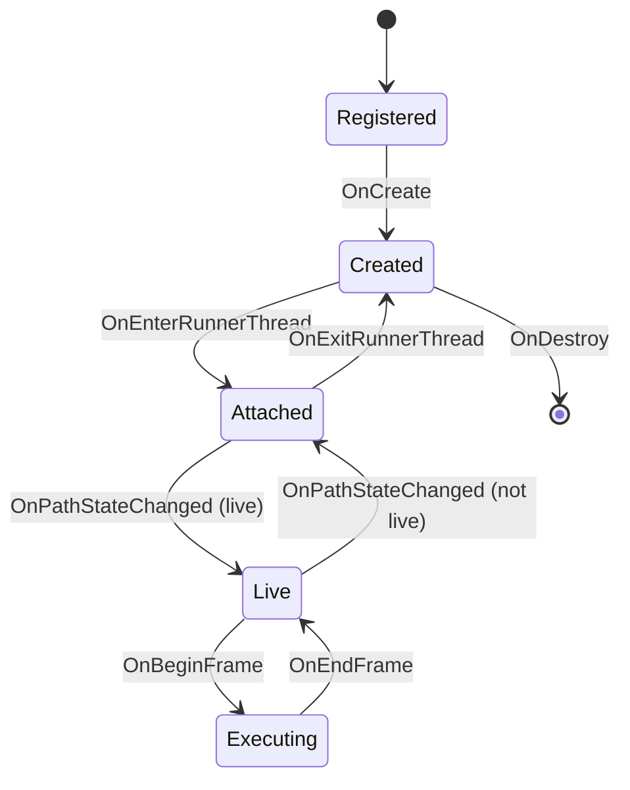

# Node lifecycle and callbacks

A node instance spends its life being called: created, told about graph edits, executed each frame,
destroyed. This page is the contract for those calls — which fire, in what order, and on which
thread.

Describes plugin SDK {{ plugin_sdk_version }} (Nodos {{ nodos_version }}). Signatures are in the
[Plugin API](plugin-api.md), along with the `nosEngine` services you call in the other direction;
this page is about *when*.

## States

**Registered** — the class exists, no instance does. Class-level callbacks only.

**Created** — one `NodeContext` instance exists for one node in the graph. It receives graph edits,
pin changes and editor events. It is not scheduled.

**Attached** — the instance belongs to a runner thread. Every node reaches this state; a node on no
path is attached to the shared idle runner.

**Live** — the node sits on a compiled path, so it will be executed. This is the state most people
mean by "running".

**Executing** — a frame is in progress on a path this node is on.

Being *created* and being *live* are independent, and confusing them is the usual cause of "my node
does nothing". A node with no route to a sink stays attached forever and never executes.

## The thread rule

**Every callback for one node instance runs on the runner thread that currently owns that node.**
Calls for a single node never overlap, so the context's own fields need no locking.

The owner is the runner of the `nos.Thread` node driving the path the node is on, or the shared
idle runner when the node is on no path.

| | |
|---|---|
| Two nodes | May run on different threads at the same time, including two instances of your own class. Plugin-wide state needs locking; node state does not. |
| One node, over time | Ownership changes when the graph recompiles: `OnExitRunnerThread` on the old thread, then `OnEnterRunnerThread` on the new one. Do not cache thread affinity across frames. |
| `RunnerId` | `nullptr` in the enter/exit params means the idle runner. |
| `Initialize` / `OnPreUnloadPlugin` | Plugin-level, not on a runner thread. `Initialize` runs on a loading thread before any node exists. |

!!! warning "The one interleaving case"
    Nothing else for the node runs while your `ExecuteNode` is on the stack — unless you return
    `NOS_RESULT_PENDING`. That parks the frame and returns to the runner's queue, so other
    callbacks can arrive before the retry.

## Registration

`static nosResult OnRegister(nosNodeFunctions&)`
:   Once per plugin load, when the class is registered. No instance exists yet. `NOS_REGISTER_NODE`
    calls it for you; a hand-written registration function using `NOS_BIND_NODE_CLASS` must call it
    itself.

`static nosResult MigrateNode(nosFbNodePtr, nosBuffer*)`
:   While a saved node of this class is being created, when it was written by a different major or
    minor version of your plugin than the one loaded. Rewrite the buffer into the current shape.

Neither runs on a runner thread, and neither has a node instance to work with.

## Creation

In this order, all on the node's runner thread:

1. **`OnCreate(nosFbNodePtr node)`** — the context has been constructed and `NodeId`, `NodeName`,
   `PinName2Id` and `Pins` are already populated from the same `node` buffer.
2. Plugin-level `OnPostNodeCreated`.
3. **`OnEnterRunnerThread`** — always, even for a node on no path.
4. **`OnPathStateChanged({IsLive = true})`** — only if the node is already on a compiled path.
5. **`OnPinObjectChanged`**, and for primitive values **`OnPinValueChanged`**, once per pin. This is
   how initial pin values arrive.
6. **`OnPinConnected`** for each connection that becomes active — both ends, including connections
   restored from a saved graph.

!!! note "`Pins` has no values in it"
    `NodePin` carries name, id, type, `ShowAs` and visualizers — not data. Read initial values from
    the flatbuffer passed to `OnCreate`, or wait for the pin callbacks in step 5.

The result of `OnCreate` is discarded. A node cannot refuse to be created; report the problem with
`SetNodeStatusMessage` and fail `ExecuteNode` instead.

## Graph edits

These arrive whenever the user or an application changes the graph, at no particular point in the
frame.

| Callback | When |
|---|---|
| `OnNodeUpdated(const nosNodeUpdate*)` | Unique name, display name, orphan state or metadata changed, or a pin or node function was created or deleted. |
| `OnPinUpdated(const nosPinUpdate*)` | One field of one pin changed — display name, `ShowAs`, type name, orphan state, liveness, read-only, metadata, source pin or visualizers. |
| `OnFunctionUpdated(const nosNodeFunctionUpdate*)` | Same, for a node function's pins. |
| `OnPinConnected(name, connectedPinId, connectedObject)` | A connection became active. `connectedObject` is the other pin's current object, or 0 if it has none yet, so you can react before being scheduled. |
| `OnPinDisconnected(name)` | A connection was removed. |
| `CanRemoveOrphanPin(name, pinId)` | An orphan pin is about to be removed. Return anything but `NOS_RESULT_SUCCESS` to keep it. |
| `OnResolvePinDataTypes(nosResolvePinDataTypesParams*)` | A connection is being made to a `nos.Generic` pin. Fill in the resolved types or an error message. |

`NodeContext` updates its own bookkeeping before your override runs, so `Pins` and `NodeName` are
already current inside `OnNodeUpdated` and `OnPinUpdated`.

!!! warning
    `OnResolvePinDataTypes` is a question, not a notification — the resolve can still be cancelled
    afterwards. Do not change node state there; wait for `OnPinUpdated`.

## Compilation

Structural changes recompile the graph into paths ([what triggers
it](../../using/explanation/scheduling.md#what-triggers-recompilation)). During compilation:

| Callback | When |
|---|---|
| `GetScheduleInfo(nosScheduleInfo*)` | The node is the leaf reached from a thread's execution pin. Declare rate, importance and schedule type for the path it terminates. |
| `OverrideConsumerDeltaSeconds(nosVec2u&)` | Your node produces frames at a different rate than the path consuming them, and you did not already specify your own delta seconds. |

Afterwards, nodes that joined or left a compiled path get `OnPathStateChanged`.

## Per frame

Path control comes first — plugin-level, then per node along the path, upstream to downstream:

| Transition | Node callback |
|---|---|
| Path stops | `OnPathStop` |
| Start requested | `OnPathStartInitiated` |
| Path starts | `OnPathStart` |

Then, for each frame of that path:

1. Plugin-level `OnBeginFrame`, then **`OnBeginFrame(pinId)`** on every node on the path.
2. For each node in path order: plugin-level `OnPreExecuteNode`, then **`ExecuteNode`** — or
   **`CopyFrom`** for a copy command, or the node function being invoked — then plugin-level
   `OnPostExecuteNode`.
3. **`OnEndFrame(pinId, cause)`** on every node on the path, then plugin-level `OnEndFrame`.

The `pinId` in `OnBeginFrame` / `OnEndFrame` identifies the path, not a pin worth reading. A node on
two paths gets one pair of calls per path.

After `ExecuteNode` returns success the engine clears the dirty flag on the node's inputs and
dirties its outputs, unless you cleared `MarkAllOutsDirty`.

### What `ExecuteNode` returns

| Result | Effect |
|---|---|
| `NOS_RESULT_SUCCESS` | The path continues to the next node. |
| `NOS_RESULT_PENDING` | The frame is parked and retried from this node. `ExecuteNode` is called again for the same frame; `OnBeginFrame` is not. |
| anything else | The frame ends with `NOS_END_FRAME_FAILED` and the node is marked failed in the editor. |

### End-of-frame causes

| Cause | Meaning |
|---|---|
| `NOS_END_FRAME_FINISHED` | Every node on the path succeeded. |
| `NOS_END_FRAME_CANCELLED` | The path was stopped with a frame in flight. |
| `NOS_END_FRAME_FAILED` | A node failed. |

!!! warning
    `ExecuteNode` is called because the scheduler decided the node is due, not because a value
    changed. To react to a value changing, override `OnPinValueChanged`.

## Events outside the frame

| Callback | When |
|---|---|
| `OnPinValueChanged` / `OnPinObjectChanged` | A pin's value or object reference changed. Sent for input and property pins; app nodes also get them for outputs. `OnPinValueChanged` only fires for primitive values, `OnPinObjectChanged` for everything. |
| `OnPinDirtied(pinId, frameCount)` | A connected application reported that it dirtied one of this node's pins. |
| `OnPathCommand(const nosPathCommand*)` | A node on the path sent a command — ring size change, or first VBL after start. |
| `OnCustomMessageReceived(nosNodeMessageParams const*)` | Another plugin or an editor sent this node a typed message. Dropped with an error if the node has no active context. |
| `OnMenuRequested` | The editor opened a context menu. The default implementation dispatches to `OnNodeMenuRequested` or `OnPinMenuRequested` by the item under the cursor. |
| `OnMenuCommand(itemId, cmd)` | An item from your menu was chosen. |
| `OnKeyEvent(const nosKeyEvent*)` | A key event was routed to this node. |

`AddPinObjectWatcher` and `AddPinValueWatcher` hang a per-pin callback off the same delivery, which
is usually less code than switching on the pin name in `OnPinObjectChanged`.

## Destruction

In this order, on the node's runner thread:

1. `OnPathStateChanged({IsLive = false})`, if the node was live.
2. `OnExitRunnerThread`.
3. **`OnDestroy`**, then the context is deleted — your destructor runs on the same thread,
   immediately after.

Release anything the engine must not outlive here: GPU resources, threads you started, references
you hold. Like `OnCreate`, the result is discarded — a node cannot refuse deletion.

Plugin-level `OnPreUnloadPlugin` runs just before the library is unloaded.

## Not guaranteed

- **Frame alignment.** Only the callbacks in [Per frame](#per-frame) are ordered against a frame.
  Graph edits and editor events land between frames, in no fixed relation to them.
- **Thread affinity.** Recompilation moves nodes between runners.
- **Ordering across nodes.** Within one frame, nodes run in path order. Nothing orders a callback on
  one node against a callback on another.
- **Execution on change.** Nothing in the value-change callbacks schedules your node. Only the
  scheduler does.

## See also

- [Plugin API](plugin-api.md) — the signatures behind every callback named here.
- [Scheduling and execution](../../using/explanation/scheduling.md) — why execution is explicit, and
  what `always_execute` really costs.
- [Node definition](node-definition.md) — the pins and functions these callbacks talk about.
