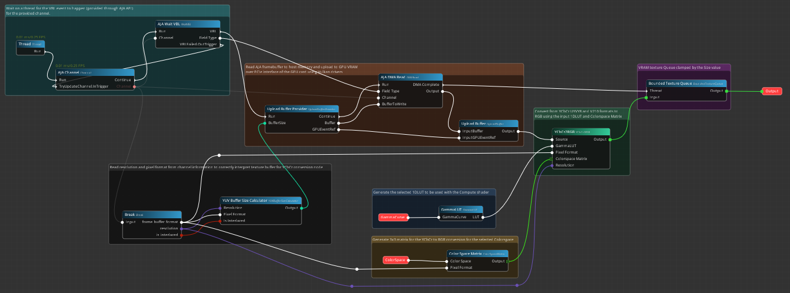

# Nodos documentation

**Nodos** is a highly extensible, node-graph based real-time computing and rendering engine.
You build a graph in an editor; Nodos compiles that graph into scheduled execution paths and runs
them across threads, the GPU, and — through its SDKs — other processes entirely.



## Where to start

<div class="grid cards" markdown>

-   ### :material-graph-outline: [Using Nodos](using/index.md)

    ---

    Install Nodos, build and run graphs, manage modules, run headless.

    Start here whoever you are — everything below assumes it.

    [Your first graph](using/tutorials/your-first-graph.md) ·
    [Install Nodos](using/how-to/install-nodos.md) ·
    [nodos CLI](using/reference/nodos-cli.md)

-   ### :material-package-variant: [Developing for Nodos](developing/index.md)

    ---

    Write plugins and subsystems, add node types, integrate an external application, publish to
    the Nodos Store.

    [Your first plugin](developing/tutorials/your-first-plugin.md) ·
    [Plugin API](developing/reference/plugin-api.md) ·
    [Node definition](developing/reference/node-definition.md)

</div>

Within each of those, pages are grouped by what you need from them — **tutorials** to learn,
**how-to guides** to get something done, **reference** to look something up, and **explanation**
to understand why Nodos behaves as it does.

## What Nodos is for

Nodos targets real-time work where a graph is a better description of the problem than a program:

- **Real-time rendering.** Vulkan-backed texture pipelines, fragment and compute shader nodes.
  Shaders are compiled and bound to pins without writing any C++.
- **Real-time AI.** ONNX models run against live video through CUDA and TensorRT, with explicit
  texture-to-tensor conversion nodes.
- **Broadcast and video I/O.** DeckLink, WebRTC, display and audio nodes ship as installable
  modules.
- **Distributed systems.** External processes attach to a running graph over gRPC and appear as
  ordinary nodes, so an existing application can borrow the engine's I/O and GPU capabilities.

## Getting started in one minute

=== "Windows (PowerShell)"

    ```powershell
    irm https://nodos.dev/install.ps1 | iex
    nodos launch
    ```

=== "Linux"

    ```bash
    curl -fsSL https://nodos.dev/install.sh | bash
    nodos launch
    ```

The installer asks whether to install the latest Nodos release as well. Accept, and it fetches the
engine into a workspace for you and creates a Nodos shortcut, so there is nothing left to download.

Then follow [Your first graph](using/tutorials/your-first-graph.md).

For the full story — prerequisites, workspaces, choosing a bundle — see
[Install Nodos](using/how-to/install-nodos.md).

## Which version these docs describe

Unless a page says otherwise, everything here describes **Nodos {{ nodos_version }}**
(plugin SDK {{ plugin_sdk_version }}, process SDK {{ process_sdk_version }}).

Bringing a plugin over from an earlier release? Manifest extensions, node definition discovery and
the CMake workflow all changed; everything you have to do is in
[Migrate a plugin to {{ nodos_version }}](developing/how-to/migrate-1-3-to-1-4.md).

## Platform support

| Platform | Status |
|---|---|
| Windows (x86_64) | Supported. Prebuilt bundles are published for every release. |
| Linux (x86_64) | Experimental. The installer works and the engine builds; bundles are not yet published. |
| macOS | Experimental. Engine and editor build against MoltenVK; not yet released. |

The GPU driver must support Vulkan 1.2. See
[Install Nodos](using/how-to/install-nodos.md) for the full requirement list.

## Getting help

Questions, bug reports and where to send them: [Get help](about/get-help.md).

Nodos is free for personal and academic use, and commercially licensed per engine — see
[Licensing](about/licensing.md).
