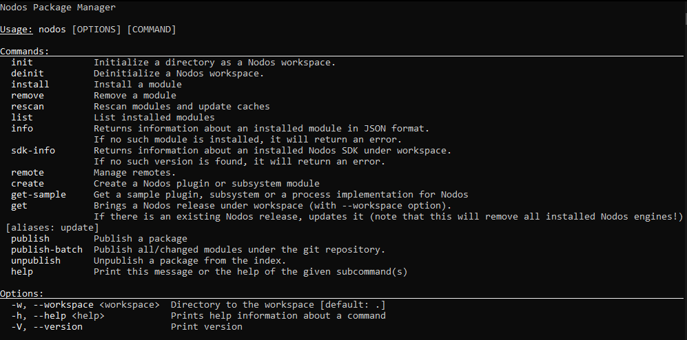

# Installation Instructions

### Developing Nodes with C++

1. **Set Up Environment**: Ensure your development environment is configured with a C++ compiler and shader compilation tools.
2. **Install Dependencies with Command-Line Interface**:
    - Open a terminal or command prompt in the Nodos directory.
    - Run `nodos install` to handle any subsystem and dependency installation.
3. **Verify Installation**: Open a terminal or command prompt and run `nodos --version` to verify the installation.

!!! info
    Just type `nodos` from command line to get help:
    