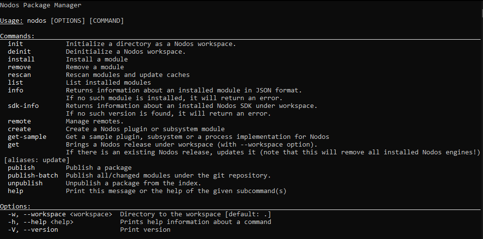

# Installation Instructions

## Installing Nodos and nosman

=== "Linux"
    ```bash
    curl -fsSL http://nodos.dev/install.sh | bash
    ```

=== "Windows (PowerShell)"
    ```powershell
    irm http://nodos.dev/install.ps1 | iex
    ```

### Prerequisites

- Linux installer checks for `git` before Nodos installation and can auto-install it using a detected package manager.
- Windows installer checks for `git` and Microsoft Visual C++ Redistributable before Nodos installation.
- On Windows, Git auto-install uses `winget` when available; VC++ runtime uses Microsoft's official redistributable installer.

### Developing Nodes with C++

1. **Set Up Environment**: Ensure your development environment is configured with a C++ compiler and shader compilation tools.
2. **Install Dependencies with Command-Line Interface**:
    - Open a terminal or command prompt in the Nodos directory.
    - Run `nosman install` to handle any subsystem and dependency installation.
3. **Verify Installation**: Open a terminal or command prompt and run `nodos --version` to verify the installation.

!!! info
    Just type `nodos` from command line to get help:
    
