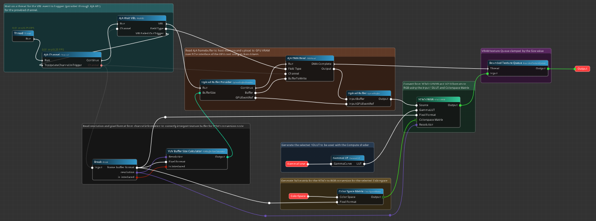

# Introduction

**Nodos** is an advanced node-based graph scheduling system that is designed to simplify and streamline the development process. The name "Nodos" humorously plays on the idea that it is "not DOS," referencing the classic MS-DOS, while also emphasizing its core functionality as a node-oriented system.

Developed in C++, Nodos provides robust support for node creation using a C API. Additionally, it integrates seamlessly with shader languages such as GLSL and HLSL, enabling the compilation and runtime linking of shaders to shader parameters without the need for additional programming. This unique capability allows developers to execute C++ code and shaders within the node graph effortlessly, enhancing productivity and flexibility.

Nodos also allows you to connect from another process to the Nodos process via cross-platform communication using the app SDK we provide. This means that even your external processes can be represented as nodes inside Nodos, enabling us to schedule and manage these processes within our comprehensive "Uber" node graph.

### Key Benefits

- **Simplified Development**: By leveraging node-based graph scheduling, Nodos simplifies the complexity of managing various tasks and processes.
- **Performance and Flexibility**: C++ development ensures high performance, while the C API support and shader integration offer flexibility for a wide range of applications.
- **Shader Integration**: Automatic handling of shader compilation and runtime linking allows for seamless execution of graphical applications without additional C++ coding.
- **Cross Process Communication**: Nodos allows you to connect from another process to the Nodos process via a cross-platform communication mechanism using the provided app SDK. This enables even external processes to be presented as nodes within Nodos.
- **Uber Node Graph**: With the ability to integrate external processes as nodes, Nodos can schedule and manage these processes within its comprehensive node graph, creating an "Uber" node graph that encompasses a wide array of tasks and operations.

### Example Applications

Nodos provides example applications to demonstrate cross-process communication:

- **Vulkan Application**: Demonstrates high-performance graphics integration using the Vulkan Graphics API.
- **DirectX 12 Application**: Demonstrates high-performance graphics integration using DirectX Graphics API.

- **Unreal Engine 5 Integration**: Nodos currently supports cross-process communication infrastructure for Unreal Engine 5. We provide an Unreal Engine 5 plugin named **Nodos Link:** **[github.com/mediaz/ue5plugin](https://github.com/mediaz/ue5plugin)**, available in our GitHub workspace. The source code for this plugin is publicly accessible, allowing developers to integrate and extend their Unreal Engine projects with Nodos seamlessly.

### Use Cases

Nodos can be utilized in various domains, including but not limited to:

- **Real-Time Rendering**: Using Vulkan, rendering nodes and image filters or compute shader nodes can be developed.
- **Real-Time AI Processing** With AI subsystem, ONNX models can be loaded and run in real-time, to process images/video. Such as segmentation, detection, depth generation, super resolution etc...
- **Distributed Systems**: Facilitates the integration and management of distributed processes, presenting them as nodes in a unified graph. Since Nodos provides a lot of capabilities in terms of video I/O, rendering, image filters and AI capabilities; your application can benefit from all these capabilities via just getting linked with Nodos AppSDK.