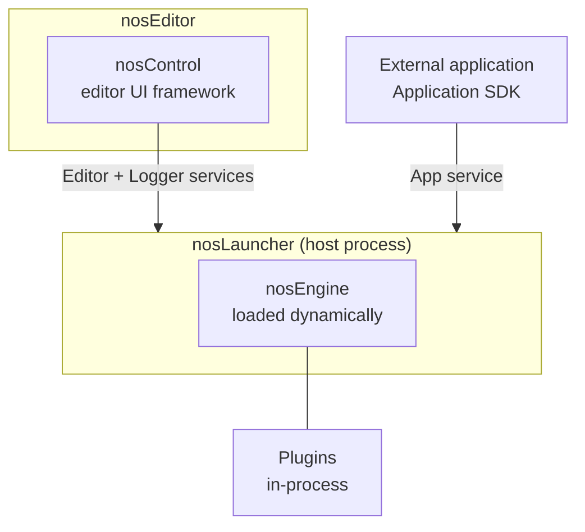

# Architecture

A running Nodos system is several processes, not one application. Understanding the split explains
a lot of otherwise surprising behaviour: why closing the editor does not stop your graph, why the
engine has network addresses, and why an external application can become a node.

## The processes



You can see all of these in an engine install under `Engine/<version>/Binaries/`.

`nosLauncher`
:   The host process. It parses the command line, loads engine settings, starts the gRPC services,
    and loads `nosEngine`. It also owns EULA handling and crash reporting.

`nosEngine`
:   The engine itself, loaded dynamically by the launcher. Your graph runs here, and your plugins
    are loaded into this process.

`nosEditor` and `nosControl`
:   The UI. `nosEditor` is the executable; `nosControl` is the editor framework it is built on. It
    is a *client* — it connects to the launcher's services and sends requests. It does not run your
    graph.

`nosMigrator`
:   Migrates saved graphs and data across version changes.

Plugins load **into** the engine process. External applications stay in their own process and talk
over gRPC.

## Why the launcher and editor are separate

Because the graph is the product, not the UI around it.

The editor can be closed while the graph keeps running — which is what makes
[headless operation](../how-to/run-nodos-headless.md) work at all. It can reconnect later. It can
connect to an engine on a different machine, since the services bind to network addresses rather
than a local socket. And an editor crash cannot take down a live playout.

This is also why `nodos launch` starts two processes, and why `nodos engine status` reports on them
separately:

```shell
nodos engine status
nodos engine stop      # stops both the engine and the editor for this workspace
```

## The three services

The launcher hosts three bidirectional gRPC services. Each has a settings key you can override per
launch.

| Service | Settings key | Default | Carries |
|---|---|---|---|
| Editor | `connection_settings/node_graph_service_address` | `0.0.0.0:50052` | Graph and editor operations |
| App | `connection_settings/app_service_address` | `0.0.0.0:50053` | External process integration |
| Logger | `connection_settings/logging_service_address` | `0.0.0.0:50051` | Log and watch transport |

```shell
nosLauncher --override-settings \
  connection_settings/app_service_address="0.0.0.0:50553"
```

All three speak FlatBuffers. That matters to you because the same schemas generate the wire
contract *and* the SDK headers you build against — so an editor, the engine and your plugin cannot
disagree about what a node is. It is also why your pin types are FlatBuffers types. See
[Objects and the type system](../../developing/explanation/objects-and-types.md).

Engines additionally broadcast their status on a UDP beacon (port `11000` by default) so editors
can discover reachable engines without being given an address. Disable it with `--disable-beacon`
on networks where you would rather they did not announce themselves.

## What runs where

This is the part that actually affects how you write code.

**Plugin node callbacks run on engine threads, not one thread.** A graph with two Thread nodes runs
work on two runner threads, and your node's context may be executed from either. Nodes can also
migrate between runner threads when the graph is recompiled — `OnEnterRunnerThread` and
`OnExitRunnerThread` exist so you can react to that. Do not assume thread affinity between calls.

**Plugin load and unload are isolated from execution.** A plugin loading or unloading does not run
inside your node's execute path, so `Initialize` and `OnPreUnloadPlugin` are not in the frame
budget.

**Application SDK callbacks arrive off your main thread.** Queue them by `FrameNumber` and drain
them from your own loop — see
[Connect an external application](../../developing/how-to/connect-an-external-app.md).

**Some engine calls are synchronous by design.** Certain service calls block to keep the graph
consistent at boundaries. In practice this means heavy editor activity during heavy runtime
activity can contend; it is not something you configure, but it explains the symptom if you see it.

## Configuration and state

Everything lives under the engine install:

| Path | Contents |
|---|---|
| `Engine/<version>/Config/EngineSettings.json` | Persisted engine settings. Created with defaults if absent. |
| `Engine/<version>/Logs/` | Runtime logs. Attach these to bug reports. |
| `Engine/<version>/EULA_CONFIRMED.json` | EULA acceptance state. |
| `Engine/<version>/SDK/info.json` | Engine, plugin SDK and process SDK versions. |

Settings can be overridden per launch without touching the file, which makes parallel and ephemeral
instances safe. See [Launcher CLI](../reference/launcher-cli.md).

## Startup, from the outside

1. `nosLauncher` starts, reads `EngineSettings.json`, and applies any `--override-settings`.
2. It starts the editor, app and logger services on their configured addresses.
3. It loads `nosEngine`, which initialises and begins processing.
4. Modules load. A module whose dependencies cannot be satisfied does not load — check the **Log**
   pane.
5. `nosEditor` connects to the editor and logger services and requests the current graph.

If a graph was passed with `--load-graph`, it is loaded and its paths begin executing without any
editor being involved.

## See also

- [Scheduling and execution](scheduling.md) — what happens to your graph between editing and
  running.
- [Extension model](../../developing/explanation/extension-model.md) — the three ways to add capability.
- [Objects and the type system](../../developing/explanation/objects-and-types.md) — what flows along the connections.
