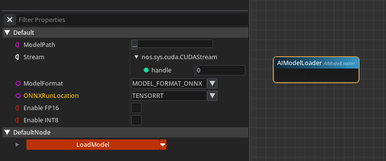
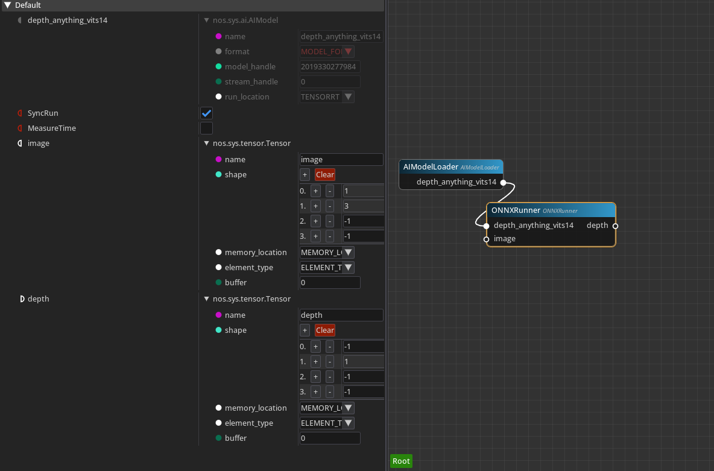
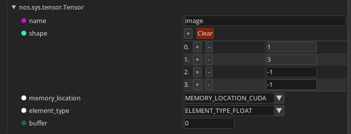
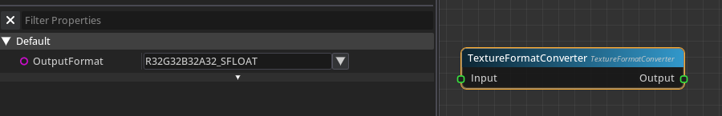
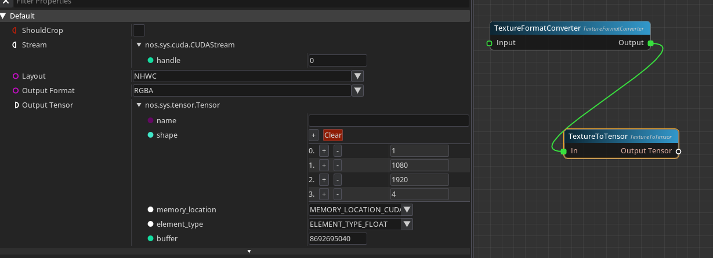
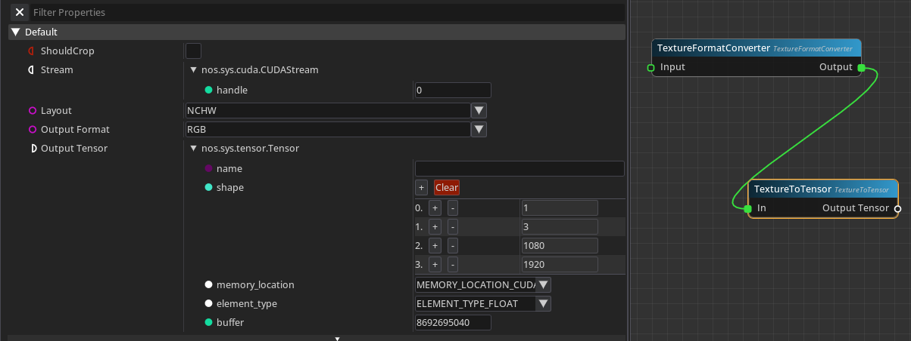
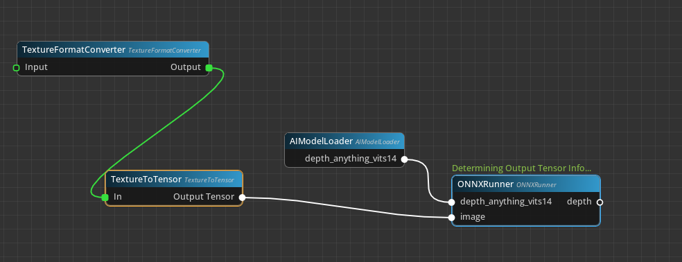
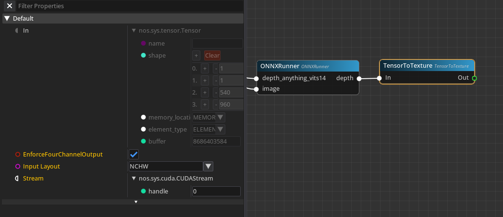
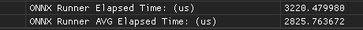
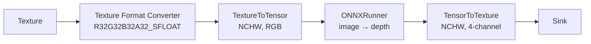

# Running an AI model

In this tutorial you will load an ONNX model into a graph, feed it a texture, and display its
output. The example is a monocular depth model, but the pipeline is the same for any
image-to-image model: segmentation, super-resolution, style transfer.

The interesting part is not loading the model. It is the conversion either side of it — Vulkan
textures and CUDA tensors do not share a memory layout, and getting that mapping right is most of
the work.

Budget about 30 minutes.

!!! note "What you need"
    - An AI-capable bundle. `nodos.bundle.ai` or `nodos.bundle.full` include the ONNX, tensor and
      CUDA modules; `standard` does not.
      ```shell
      nodos get --name nodos.bundle.ai --version {{ nodos_version }}
      ```
    - An NVIDIA GPU, if you want TensorRT. ONNX Runtime will fall back to other execution providers
      without one.
    - An ONNX model file. Anything ONNX Runtime 1.16 supports will load.
    - [Your first graph](your-first-graph.md) completed.

## Step 1: Load the model

Right-click the node graph and add an **AI Model Loader** node, under *ML → AI Models*.



Set **Model Path** to your `.onnx` file, then choose an **ONNXRunLocation**. TensorRT with FP16
optimisation is the right default for most models and the fastest by a wide margin. Not every model
converts cleanly — if it fails, the load fails loudly and the **Log** pane explains why, at which
point fall back to another execution provider.

!!! tip "Set the Stream pin before loading"
    For a fully asynchronous GPU inference pipeline, connect the **Stream** pin *before* clicking
    **LoadModel**. It is read at load time; setting it afterwards has no effect until you reload.

Click **LoadModel**.

!!! info "Why the first run is slow"
    TensorRT optimisation takes time. For models with dynamic input or output — any dimension
    reported as `-1` — it cannot even start until it knows the real input shape, so it runs when
    you first connect an input. The node reports `Determining Output Tensor Info...` while this
    happens. This is expected, and it is cached afterwards.

## Step 2: Inspect what the model wants

Connect the **Model** pin to an **ONNXRunner** node. It reports the model's inputs and outputs.



Here the model takes an input tensor named `image` with shape `(1, 3, -1, -1)` and produces `depth`
with shape `(-1, 1, -1, -1)`.

Read that shape carefully, because everything downstream depends on it:

- `1` — batch size.
- `3` — channels. Three, not four: this model wants RGB, not RGBA.
- `-1, -1` — height and width, dynamic. The model will accept whatever you give it.

This ordering — batch, channel, height, width — is **NCHW**. Textures are naturally **NHWC**. You
will have to convert.

Now check the element type. Select the tensor pin and look at its `element_type` field.



It is `float` — 32 bits per element. Your texture has to match.

## Step 3: Convert the texture to a tensor

Three things must line up: the element type, the channel count, and the dimension order.

### Fix the element type

Add a **Texture Format Converter** node and set **OutputFormat** to `R32G32B32A32_SFLOAT`. That
gives you 32-bit floats per channel, matching the model's `float` element type.



(If your source texture is already `R32G32B32A32_SFLOAT`, you can skip this node.)

### Convert to a tensor

Add a **TextureToTensor** node and connect the format converter's output into it.



By default it produces NHWC with four channels. The model wants NCHW with three. Change both:

- Set **Layout** to `NCHW`.
- Set **Output Format** to `RGB`.



The output tensor now reports `(1, 3, 1080, 1920)` — batch 1, 3 channels, and the real height and
width of your texture. That matches `(1, 3, -1, -1)`.

## Step 4: Run inference

Connect the tensor into the model's `image` input.

If the model has dynamic dimensions, this is the moment TensorRT optimisation actually runs, since
it now knows the concrete shape. The node reports its progress.



## Step 5: Convert the output back to a texture

Connect the model's `depth` output to a **TensorToTexture** node, and mirror the settings you used
going in:

- Set **Layout** to `NCHW`, matching the model's output.
- Enable **EnforceFourChannelOutput**. The depth output has a single channel, and displays expect
  four.



Wire the resulting texture into whatever you want to display it with, and attach the path to a
Thread and a Sink.

You now have a running real-time depth pipeline.

## Step 6: Measure it

Before you tune anything, measure. On the **ONNXRunner** node, enable **Measure Time**. Then open
the **Watch** pane and observe:

- `ONNX Runner Elapsed Time`
- `ONNX Runner AVG Elapsed Time`

Both are in microseconds, and both are GPU time.



## What you built



The reusable lesson is the shape of the pipeline. For any image-to-image model:

1. Read the model's input tensor: element type, channel count, layout.
2. Convert the texture's format to match the element type.
3. Convert texture to tensor with the model's layout and channel count.
4. Run.
5. Convert back, padding channels if the display needs four.

Only the numbers change between models.

## Next

- [Use the Vulkan subsystem](../../developing/how-to/use-the-vulkan-subsystem.md) — if you want to write your own
  GPU nodes around this pipeline.
- [Objects and the type system](../../developing/explanation/objects-and-types.md) — why textures and tensors are
  passed around as object references rather than copied.
