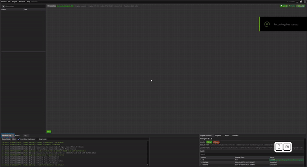
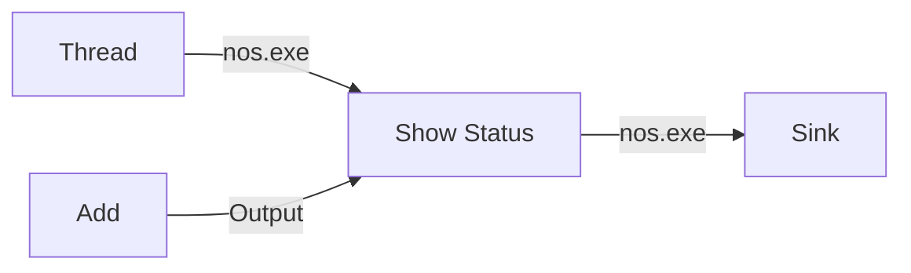

# Your first graph

In this tutorial you will install Nodos, open the editor, and build a graph that adds two numbers
and displays the result. By the end you will have run something, and you will know why a Nodos
graph needs an execution root before it does anything at all.

No programming is involved. Budget about 15 minutes.

!!! note "What you need"
    - Windows 10 or later on x86_64 (Linux and macOS work but are not yet released — see
      [Install Nodos](../how-to/install-nodos.md)).
    - A GPU driver supporting Vulkan 1.2.
    - Nothing else. The installer brings its own prerequisites.

## Step 1: Install the package manager

Nodos is distributed through `nodos`, its workspace and package manager. Install it first:

=== "Windows (PowerShell)"

    ```powershell
    irm https://nodos.dev/install.ps1 | iex
    ```

=== "Linux"

    ```bash
    curl -fsSL https://nodos.dev/install.sh | bash
    ```

On Windows the installer also checks for the Microsoft Visual C++ Redistributable and offers to
install it if it is missing.

Confirm it worked:

```shell
nodos --version
```

## Step 2: Create a workspace and fetch the engine

Nodos keeps everything — engine, modules, generated projects — inside a **workspace**: an ordinary
directory marked with a `.nosman` folder. Make one:

```shell
mkdir MyNodos
cd MyNodos
nodos init
```

Now pull down an engine release. `nodos get` fetches a *bundle*, which is an engine plus a curated
set of modules:

```shell
nodos get --name nodos.bundle.standard --version {{ nodos_version }}
```

!!! tip "Bundles"
    `nodos.bundle.standard` is a good default. There are others — `minimal`, `broadcast`, `ai`,
    `full` — that trade download size against how much is preinstalled. See
    [Manage packages](../how-to/manage-packages.md#bundles).

The first run asks you to accept the EULA. Accept it to continue.

## Step 3: Launch the editor

```shell
nodos launch
```

Two things start: **`nosLauncher`**, the host process that owns the engine and actually runs your
graph, and **`nosEditor`**, the UI that connects to it. This split matters later — the editor can
be closed, reconnected, or pointed at an engine on another machine, and the graph keeps running.

You should see an empty node graph.

## Step 4: Add two numbers

Right-click on empty space in the node graph. This opens the node search menu, listing every node
class the loaded modules provide.

1. Search for **Add** and place it. It sits under the *Arithmetic* category.
2. The Add node has three pins: `A` and `B` as inputs, and `Output`.

Notice that `A`, `B` and `Output` do not have a concrete data type yet. They are declared as
`nos.Generic`, and the node takes its type from whatever you connect or type into it. Set `A` to
`2` and `B` to `3` directly in the node — the pins resolve to a numeric type as you do.



At this point nothing is running. The Add node is sitting in the graph, unscheduled. Nodos will not
execute a node just because it exists.

## Step 5: Give the graph a reason to run

A Nodos graph executes along **paths**, and a path needs two things: something to drive it and
something to terminate it.

1. Right-click and add a **Thread** node. This is the engine's `nos.Thread` class, and it
   represents an actual runner thread. It is where execution originates.
2. Right-click and add a **Sink** node, from the *Utilities* category. A sink terminates a path and
   sets its rate — look at its `Sink FPS` property, which defaults to 60.

Now wire it up:

1. Drag from the Thread node's execution output to the Sink's **`InExe`** pin. Execution pins carry
   the `nos.exe` type and are drawn differently from data pins — they carry no value, only the fact
   that something should run.
2. Drag from the Add node's **`Output`** to the Sink's **`Sink Input`** pin.

The graph now compiles into a path: the thread drives the sink at 60 FPS, the sink pulls its input,
and pulling the input executes the Add node.

!!! info "Why the extra ceremony?"
    Other node systems evaluate whatever is connected. Nodos schedules explicitly, because it is
    built for real-time work where *when* and *how often* a node runs is part of the problem, not
    an implementation detail. [Scheduling and execution](../explanation/scheduling.md) covers what
    the compiler does with the graph you just built.

## Step 6: See the result

To watch the value, add a **Show Status** node from the *Flow* category. It displays whatever
reaches its `Status` pin as the node's own status message.

Insert it into the execution chain:

1. Connect the Thread node's execution output to Show Status's **`Run`** pin.
2. Connect Show Status's **`Continue`** pin to the Sink's **`InExe`** pin.
3. Connect the Add node's **`Output`** to Show Status's **`Status`** pin.

Show Status now runs each frame and reports the sum.

You can also select the Add node and open the **Watch** pane to observe `Output` directly, which is
the general way to inspect any pin value while a graph runs.

## What you built



Three ideas are worth carrying forward:

**Pins are typed, and some types are generic.** `nos.Generic` pins resolve when connected. This is
how one Add node serves integers, floats and vectors. See
[Built-in data types](../../developing/reference/builtin-types.md).

**Execution is separate from data.** `nos.exe` pins express ordering; data pins express values.
A node with no path to a sink never runs.

**The engine is not the editor.** You were editing a graph hosted in another process the whole
time.

## Next

- [Your first plugin](../../developing/tutorials/your-first-plugin.md) — write a node of your own in C++.
- [Scheduling and execution](../explanation/scheduling.md) — what actually happened when you
  connected that thread.
- [Run Nodos headless](../how-to/run-nodos-headless.md) — save this graph and run it without an
  editor.
